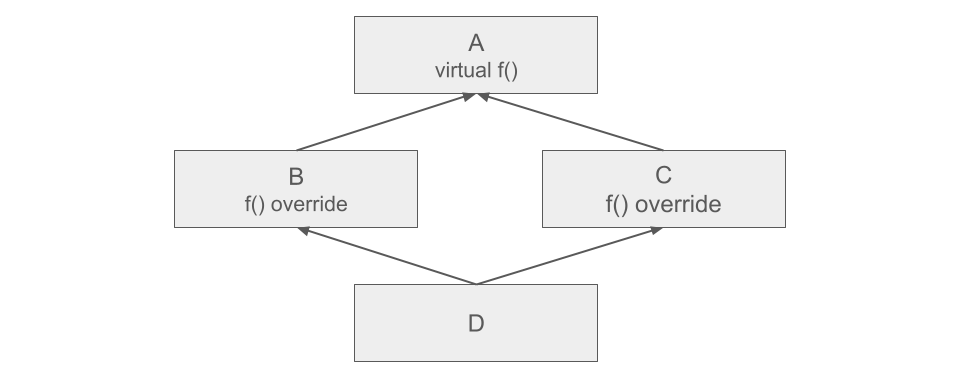
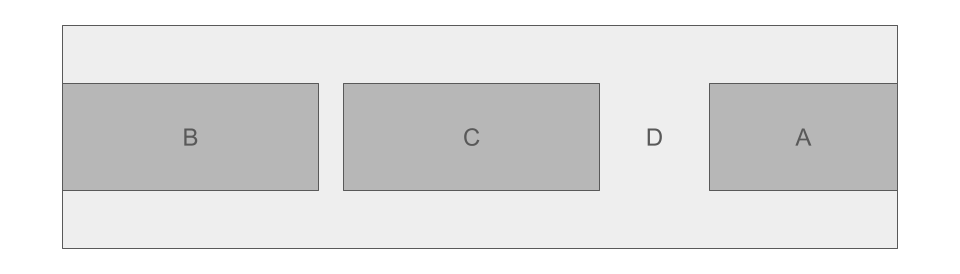

# 15. SOLID принципи. Множествено наследяване, диамантен проблем и виртуално наследяване в C++

## [SOLID принципи](https://github.com/StefanShivarov/oop-course-fmi-2026/tree/main/SOLID%20Principles)

## Множествено наследяване

В C++ един клас може да наследява повече от един базов клас. Това се нарича **множествено наследяване**.

Пример:

```cpp
class Printer {
public:
    void print() {
        std::cout << "Printing...\n";
    }
};

class Scanner {
public:
    void scan() {
        std::cout << "Scanning...\n";
    }
};

class MultifunctionDevice : public Printer, public Scanner {
public:
    void use() {
        print();
        scan();
    }
};
```

`MultifunctionDevice` наследява едновременно `Printer` и `Scanner`.

Това е логично, защото едно многофункционално устройство може да се държи и като принтер, и като скенер.

```cpp
MultifunctionDevice device;

device.print();
device.scan();
device.use();
```

Концептуално в паметта обектът изглежда така:

```text
MultifunctionDevice object
+-------------------------------+
| Printer subobject             |
+-------------------------------+
| Scanner subobject             |
+-------------------------------+
| MultifunctionDevice data      |
+-------------------------------+
```

Базовите класове не съществуват отделно от обекта. Те са части вътре в него. Тоест един `MultifunctionDevice` обект съдържа `Printer` част, `Scanner` част и собствена `MultifunctionDevice` част.

### Конфликт при еднакви имена

Проблем може да се появи, ако два базови класа имат функции или полета с еднакво име.

```cpp
class Printer {
public:
    void start() {
        std::cout << "Printer started\n";
    }
};

class Scanner {
public:
    void start() {
        std::cout << "Scanner started\n";
    }
};

class MultifunctionDevice : public Printer, public Scanner {};
```

Тогава това е неясно:

```cpp
MultifunctionDevice device;
device.start();
```

Компилаторът не знае дали трябва да извика:

```cpp
Printer::start()
```

или:

```cpp
Scanner::start()
```

Затова трябва или да се override-не проблемната функция в наследника:
```cpp
class MultifunctionDevice : public Printer, public Scanner {
    //...
public:
    void start() override {
        std::cout << "Starting multifunction device...";
    }
};
```

Или да уточним коя от двете родителски версии да се използва:

```cpp
class MultifunctionDevice : public Printer, public Scanner {
    //...
public:
    using Printer::start;
};
```

## Диамантеният проблем

Диамантеният проблем се появява, когато два класа наследяват един и същ базов клас, а след това трети клас наследява и двата.




Пример:

```cpp
class Device {
public:
    std::string serialNumber;

    Device(const std::string& serialNumber)
        : serialNumber(serialNumber) {}
};

class Printer : public Device {
public:
    int pagesPerMinute;

    Printer(const std::string& serialNumber, int pagesPerMinute)
        : Device(serialNumber),
          pagesPerMinute(pagesPerMinute) {}
};

class Scanner : public Device {
public:
    int dpi;

    Scanner(const std::string& serialNumber, int dpi)
        : Device(serialNumber),
          dpi(dpi) {}
};

class MultifunctionDevice : public Printer, public Scanner {
public:
    std::string model;

    MultifunctionDevice(
        const std::string& printerSerial,
        int pagesPerMinute,
        const std::string& scannerSerial,
        int dpi,
        const std::string& model
    )
        : Printer(printerSerial, pagesPerMinute),
          Scanner(scannerSerial, dpi),
          model(model) {}
};
```

Йерархията изглежда така:

```text
        Device
       /      \
  Printer    Scanner
       \      /
 MultifunctionDevice
```

`MultifunctionDevice` стига до `Device` по два пътя:

```text
MultifunctionDevice -> Printer -> Device
MultifunctionDevice -> Scanner -> Device
```

Без виртуално наследяване това означава, че в един `MultifunctionDevice` обект има две отделни `Device` части.

```text
MultifunctionDevice object
+--------------------------------+
| Printer subobject              |
| +----------------------------+ |
| | Device subobject           | |
| | serialNumber               | |
| +----------------------------+ |
| pagesPerMinute                |
+--------------------------------+
| Scanner subobject              |
| +----------------------------+ |
| | Device subobject           | |
| | serialNumber               | |
| +----------------------------+ |
| dpi                            |
+--------------------------------+
| model                          |
+--------------------------------+
```

Тоест обектът има две различни `serialNumber` полета:

```text
Printer::Device::serialNumber
Scanner::Device::serialNumber
```

Затова това е неясно:

```cpp
MultifunctionDevice device(...);

device.serialNumber = "SN-001";
```

Компилаторът не знае кое `serialNumber` имаме предвид — това, което идва през `Printer`, или това, което идва през `Scanner`.

Можем да го уточним ръчно:

```cpp
device.Printer::serialNumber = "PR-001";
device.Scanner::serialNumber = "SC-001";
```

Но ако `MultifunctionDevice` представлява едно реално устройство, това не е удобно. Едно физическо устройство обикновено трябва да има една обща `Device` част, а не две отделни.

## Виртуално наследяване

Виртуалното наследяване решава диамантения проблем, като прави общия базов клас споделен.




```cpp
class Device {
public:
    std::string serialNumber;

    Device(const std::string& serialNumber)
        : serialNumber(serialNumber) {}
};

class Printer : virtual public Device {
public:
    int pagesPerMinute;

    Printer(const std::string& serialNumber, int pagesPerMinute)
        : Device(serialNumber),
          pagesPerMinute(pagesPerMinute) {}
};

class Scanner : virtual public Device {
public:
    int dpi;

    Scanner(const std::string& serialNumber, int dpi)
        : Device(serialNumber),
          dpi(dpi) {}
};

class MultifunctionDevice : public Printer, public Scanner {
public:
    std::string model;

    MultifunctionDevice(
        const std::string& serialNumber,
        int pagesPerMinute,
        int dpi,
        const std::string& model
    )
        : Device(serialNumber),
          Printer(serialNumber, pagesPerMinute),
          Scanner(serialNumber, dpi),
          model(model) {}
};
```

Ключовата разлика е тук:

```cpp
class Printer : virtual public Device
```

и тук:

```cpp
class Scanner : virtual public Device
```

Ако `Printer` и `Scanner` се срещнат в един общ наследник,
Device трябва да съществува само веднъж.

С виртуално наследяване `MultifunctionDevice` изглежда концептуално така:

```text
MultifunctionDevice object
+--------------------------------+
| Printer subobject              |
| pagesPerMinute                 |
+--------------------------------+
| Scanner subobject              |
| dpi                            |
+--------------------------------+
| data                           |
+--------------------------------+
| shared Device subobject        |
| serialNumber                   |
+--------------------------------+
```

Вече има само едно `serialNumber` поле.

```cpp
MultifunctionDevice device("SN-001", 30, 1200, "OfficePro");

device.serialNumber = "SN-002"; // OK
```

Това вече не е двусмислено, защото `Device` съществува само веднъж в крайния обект.

## Какво означава виртуалното наследяване за наследниците

Когато напишем:

```cpp
class Printer : virtual public Device
```

това не означава, че `Printer` вече няма `Device` част. Означава, че тази `Device` част може да бъде споделена, ако `Printer` участва в по-голяма йерархия.

Ако създадем директно `Printer`, тогава `Printer` сам конструира своя `Device`.

```cpp
Printer printer("PR-001", 20);
```

Тук обектът е просто `Printer`, затова няма кой друг да създаде `Device`.

Но ако създадем `MultifunctionDevice`, тогава `Device` се създава от `MultifunctionDevice`.

```cpp
MultifunctionDevice device("SN-001", 30, 1200, "OfficePro");
```

В този случай `Printer` и `Scanner` не създават отделни `Device` обекти. Те използват един и същ споделен виртуален базов обект.

### Отговорност при конструиране

При нормално наследяване наследникът конструира директния си базов клас.

```cpp
class Base {
public:
    Base(int value) {}
};

class A : public Base {
public:
    A()
        : Base(10) {}
};
```

Тук `A` отговаря за създаването на `Base`.

При виртуално наследяване правилото е различно. Виртуалният базов трябва експлицитно да се конструира и от най-долния, най-конкретния клас.

В тази йерархия:

```cpp
class Device {
public:
    Device(const std::string& serialNumber) {}
};

class Printer : virtual public Device {
public:
    Printer(const std::string& serialNumber)
        : Device(serialNumber) {}
};

class Scanner : virtual public Device {
public:
    Scanner(const std::string& serialNumber)
        : Device(serialNumber) {}
};

class MultifunctionDevice : public Printer, public Scanner {
public:
    MultifunctionDevice(const std::string& serialNumber)
        : Device(serialNumber),
          Printer(serialNumber),
          Scanner(serialNumber) {}
};
```

при създаване на:

```cpp
MultifunctionDevice device("SN-001");
```

`Device` се конструира от `MultifunctionDevice`.

Инициализациите на `Device` вътре в `Printer` и `Scanner` няма да създадат отделни `Device` обекти, когато създаваме `MultifunctionDevice`.

```cpp
Printer printer("PR-001");
Scanner scanner("SC-001");
```

Но когато създаваме `MultifunctionDevice`, най-долният клас поема отговорността за виртуалния базов клас.

### Ред на конструиране

При клас с виртуално наследяване редът на извикване е:

1. virtual base classes
2. non-virtual base classes
3. член-данни
4. тяло на конструктора


За:

```cpp
class MultifunctionDevice : public Printer, public Scanner {
public:
    std::string model;
};
```

редът е:

```text
Device
Printer
Scanner
model
MultifunctionDevice constructor body
```

`Device` се създава първи, защото е виртуален базов клас.

След това се създават невиртуалните базови класове в реда, в който са написани в декларацията:

```cpp
class MultifunctionDevice : public Printer, public Scanner
```

Това означава първо `Printer`, после `Scanner`.

Редът не се определя от подредбата в initializer list-а.

Дори да напишем:

```cpp
MultifunctionDevice(...)
    : Scanner(serialNumber, dpi),
      Printer(serialNumber, pagesPerMinute),
      Device(serialNumber),
      model(model) {}
```

реалният ред пак е:

```text
Device
Printer
Scanner
model
MultifunctionDevice constructor body
```

Компилаторът следва реда от декларацията на класа, не реда, в който сме ги написали в initializer list-а.

### Ред на разрушаване

Разрушаването става в обратен ред.

Ако конструирането е:

```text
Device
Printer
Scanner
model
MultifunctionDevice constructor body
```

разрушаването е:

```text
MultifunctionDevice destructor body
model
Scanner
Printer
Device
```

`Device` се унищожава последен, защото е споделеният виртуален базов клас. Така `Printer` и `Scanner` могат да го използват до края на собственото си разрушаване.

### Копиращ конструктор при множествено наследяване

Копиращият конструктор създава нов обект като копие на вече съществуващ обект.

```cpp
MultifunctionDevice copy = original;
```

При копиращо конструиране редът е същият като при нормално конструиране:

1. virtual base classes
2. non-virtual base classes
3. член-данни
4. тяло на конструктора

Пример:

```cpp
class Device {
public:
    std::string serialNumber;

    Device(const std::string& serialNumber)
        : serialNumber(serialNumber) {}

    Device(const Device& other)
        : serialNumber(other.serialNumber) {
        std::cout << "Device copied\n";
    }
};

class Printer : virtual public Device {
public:
    int pagesPerMinute;

    Printer(const std::string& serialNumber, int pagesPerMinute)
        : Device(serialNumber),
          pagesPerMinute(pagesPerMinute) {}

    Printer(const Printer& other)
        : Device(other),
          pagesPerMinute(other.pagesPerMinute) {
        std::cout << "Printer copied\n";
    }
};

class Scanner : virtual public Device {
public:
    int dpi;

    Scanner(const std::string& serialNumber, int dpi)
        : Device(serialNumber),
          dpi(dpi) {}

    Scanner(const Scanner& other)
        : Device(other),
          dpi(other.dpi) {
        std::cout << "Scanner copied\n";
    }
};

class MultifunctionDevice : public Printer, public Scanner {
public:
    std::string model;

    MultifunctionDevice(
        const std::string& serialNumber,
        int pagesPerMinute,
        int dpi,
        const std::string& model
    )
        : Device(serialNumber),
          Printer(serialNumber, pagesPerMinute),
          Scanner(serialNumber, dpi),
          model(model) {}

    MultifunctionDevice(const MultifunctionDevice& other)
        : Device(other),
          Printer(other),
          Scanner(other),
          model(other.model) {
        std::cout << "MultifunctionDevice copied\n";
    }
};
```

При:

```cpp
MultifunctionDevice copied = original;
```

редът е:

```text
Device copied
Printer copied
Scanner copied
model copied
MultifunctionDevice copied
```

Най-важната част е:

```cpp
MultifunctionDevice(const MultifunctionDevice& other)
    : Device(other),
      Printer(other),
      Scanner(other),
      model(other.model) {}
```

`MultifunctionDevice` копира `Device`, защото `Device` е виртуален базов клас. Това е отговорност на най-долния клас.

Това в `Printer`:

```cpp
Printer(const Printer& other)
    : Device(other),
      pagesPerMinute(other.pagesPerMinute) {}
```

и това в `Scanner`:

```cpp
Scanner(const Scanner& other)
    : Device(other),
      dpi(other.dpi) {}
```

има значение, когато копираме самостоятелен `Printer` или самостоятелен `Scanner`.

Когато обаче копираме `MultifunctionDevice`, виртуалният `Device` се копира от `MultifunctionDevice`.
